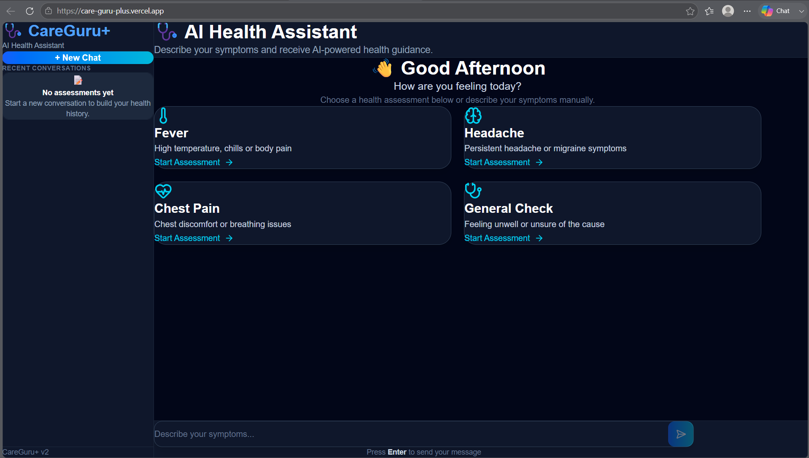
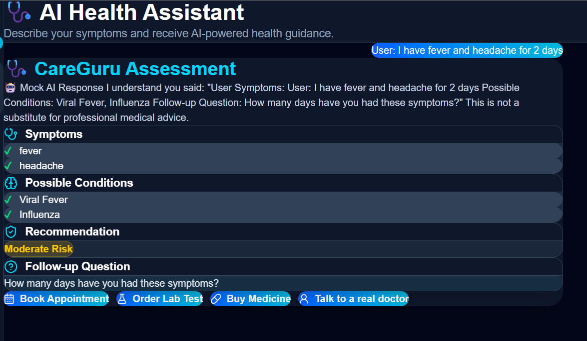
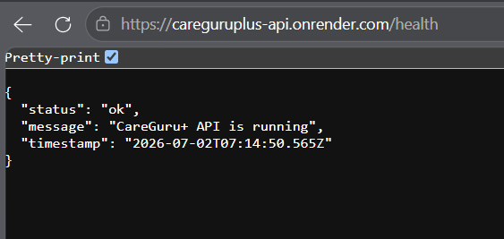

# 🩺 CareGuru+ – AI Powered Healthcare Assistant

<p align="center">


</p>

---

## 🌍 Live Demo

### Frontend

https://care-guru-plus.vercel.app

### Backend API

https://careguruplus-api.onrender.com

### Health Endpoint

https://careguruplus-api.onrender.com/health

### GitHub Repository

https://github.com/nishantmalik2810/CareGuruPlus

---

# 📖 Overview

CareGuru+ is an AI-powered healthcare assistant designed to provide an interactive symptom assessment experience. Users can describe their symptoms in natural language, receive AI-generated health guidance, view possible conditions, and get recommendations based on their inputs.

The application follows a modern full-stack architecture using React, Express, Prisma ORM, PostgreSQL, and cloud deployment with Vercel and Render.

> **Disclaimer:** This application is for educational purposes only and is **not a substitute for professional medical advice.**

---

# ✨ Features

- 🤖 AI-powered health assistant
- 💬 Interactive symptom assessment
- 🧠 Context-aware conversation flow
- 🚨 Emergency symptom detection
- 🩺 Possible condition suggestions
- 📋 Follow-up questions
- 📅 Book Appointment action
- 🧪 Order Lab Test action
- 💊 Buy Medicine action
- 👨‍⚕️ Talk to a Real Doctor option
- ⚡ REST API backend
- 🗄 PostgreSQL database
- 🔥 Prisma ORM
- 🌐 Cloud deployment
- 📱 Responsive UI
- 🛡 Secure backend architecture

---

# 📸 Application Screenshots

## 🏠 Home Screen



---

## 🤖 AI Assessment



---

## ❤️ Backend Health Check



---

# 🏗 System Architecture

```
             React + TypeScript
                     │
                     ▼
              Axios REST Calls
                     │
                     ▼
          Express.js Backend API
                     │
     ┌───────────────┼──────────────┐
     ▼               ▼              ▼
Conversation     Emergency      AI Response
 Engine          Detection      Formatter
                     │
                     ▼
                Prisma ORM
                     │
                     ▼
               PostgreSQL DB
                     │
                     ▼
                 Render Cloud
```

---

# 🛠 Tech Stack

## Frontend

- React 19
- TypeScript
- Vite
- Axios
- Framer Motion
- Lucide React

## Backend

- Node.js
- Express.js
- TypeScript
- Prisma ORM
- PostgreSQL

## Deployment

- Vercel
- Render

---

# 📂 Project Structure

```
CareGuruPlus
│
├── frontend
│   ├── src
│   ├── public
│   └── package.json
│
├── prisma
│
├── src
│   ├── config
│   ├── database
│   ├── modules
│   ├── shared
│   └── server.ts
│
├── screenshots
│
└── README.md
```